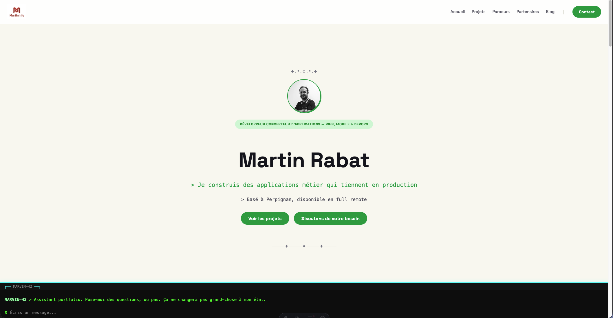

# Portfolio Rétro 90s — Martin

```
╔══════════════════════════════════════════════╗
║  C:\MARTIN\PORTFOLIO> _                       ║
║  Chargement du CV... [########--] 90s STYLE   ║
╚══════════════════════════════════════════════╝
```



Bienvenue dans le dépôt de mon portfolio perso, thème 90s assumé. C'est du code
public : copie-le, forke-le, pique ce qui te plaît, améliore ce qui te semble
moche. Aucune obligation de me créditer, mais un petit mot fait toujours
plaisir si tu t'en sers.

Un détail qui sort du lot : le site embarque un agent conversationnel façon
Marvin-42 (voir `src/pages/api/chat.ts`), branché sur Groq, qui répond aux
questions des visiteurs à partir des vraies données du portfolio (parcours,
compétences, témoignages) — pas d'improvisation, il ne répond que sur ce qui
est réellement dans le repo.

Et pour les curieux qui fouillent : il y a aussi un easter egg planqué sur
`/wargames`, un morpion contre une IA imbattable (minimax), dans un terminal
façon WOPR/WarGames. Shall we play a game?

Portfolio développé avec [Astro](https://astro.build) 7, Tailwind CSS 4, React 19 et Bun.

## Ajouter du contenu

### Parcours (timeline carrière)

Fichier : `src/data/parcours.ts`

```ts
{
  periode: "2024—2025",
  titre: "Ton poste",
  entreprise: "Nom de l'entreprise",
  desc: "Description de ce que tu as fait.",
}
```

Les entrées s'affichent dans l'ordre du tableau (de la plus récente à la plus ancienne).

Le fichier exporte un `Record<Lang, ...>` : un bloc `fr` et un bloc `en`, à tenir
alignés (mêmes entrées, même ordre). `bun run test` (`src/data/parity.test.ts`)
vérifie cette parité et échoue si les deux langues divergent.

### Compétences

Fichier : `src/data/skills.ts`

```ts
export const skills: Record<Lang, Record<string, string[]>> = {
  fr: {
    Frontend: ["HTML", "CSS", "JavaScript"],
    Backend: ["Node.js", "Python"],
    Design: ["Figma"],
    Outils: ["Git", "VS Code"],
  },
  en: {
    Frontend: ["HTML", "CSS", "JavaScript"],
    Backend: ["Node.js", "Python"],
    Design: ["Figma"],
    Tools: ["Git", "VS Code"],
  },
};
```

Ajoute/modifie des catégories et des listes de compétences librement, en gardant
le bloc `en` aligné sur le bloc `fr` (même vérifié par `bun run test`).

### Projets

Crée un fichier `.md` dans `src/content/projects/fr/` puis, sa traduction, sous le
même nom dans `src/content/projects/en/` — le plus simple est de copier le
template complet `docs/templates/projet.md` (sections prêtes à remplir) :

```md
---
title: "Nom du projet"
date: 2026-07-20
tags: ["React", "Node.js"]
description: "Courte description du projet."
image: "/projects/nom-du-projet/thumbnail.jpg"   # optionnel
url: "https://exemple.com"      # optionnel
github: "https://github.com/..." # optionnel
---

Description détaillée en Markdown…
```

Les projets s'affichent du plus récent au plus ancien. Sans version anglaise
(même nom de fichier absent de `en/`), la page EN affiche le texte français
avec un badge signalant qu'il n'est pas encore traduit.

#### Images

Convention de rangement : un sous-dossier par projet dans `public/projects/<slug>/`
(où `<slug>` = nom du fichier `.md`, sans l'extension). La vignette utilisée sur
l'accueil et la liste des projets va dans `image` (ex. `thumbnail.jpg`). Si le
fichier n'existe pas encore, les initiales du projet s'affichent automatiquement
à la place — pas besoin d'attendre d'avoir une image pour publier une fiche.

Pour des captures dans le corps de l'article (section "Visuels" par exemple),
utilise directement la syntaxe Markdown :

```md

```

Ces images sont automatiquement réduites à l'affichage et s'agrandissent au clic
(lightbox), sans configuration supplémentaire — ça vaut aussi pour les images
dans les articles de blog.

### Articles de blog

Crée un fichier `.md` dans `src/content/blog/fr/` puis, sa traduction, sous le
même nom dans `src/content/blog/en/` :

```md
---
title: "Titre de l'article"
date: 2026-07-29
tags: ["dev", "rétro"]
description: "Accroche de l'article."
---

## Contenu

Ton article en Markdown…
```

Même règle de repli que pour les projets : sans traduction, la page EN affiche
le texte français avec un badge.

## Développement

```bash
bun install
bun run dev        # serveur local sur localhost:4321
bun run build      # build de production dans dist/
bun run preview    # prévisualisation du build
```

Le mode dev se lance en arrière-plan avec `astro dev --background`.
