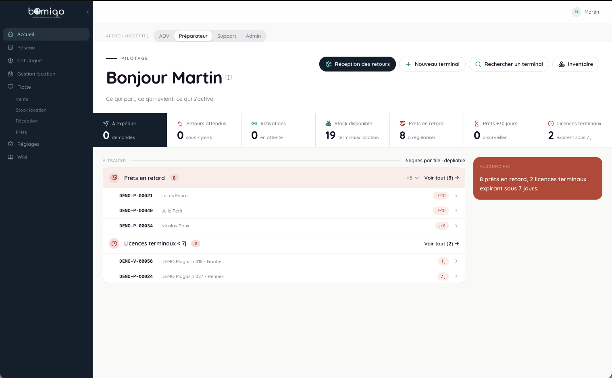
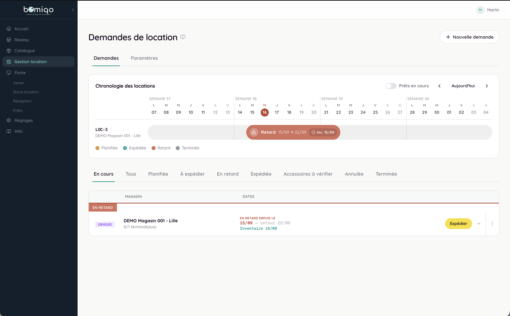
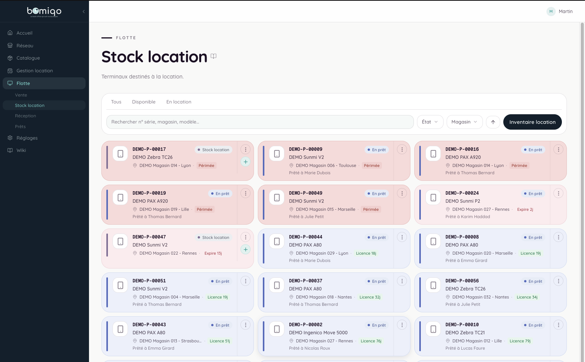
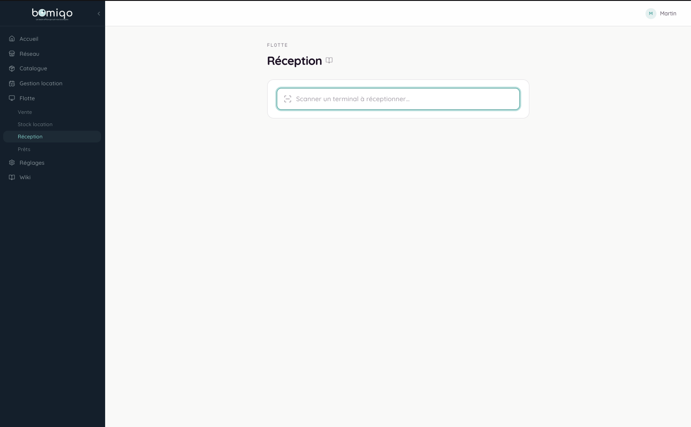
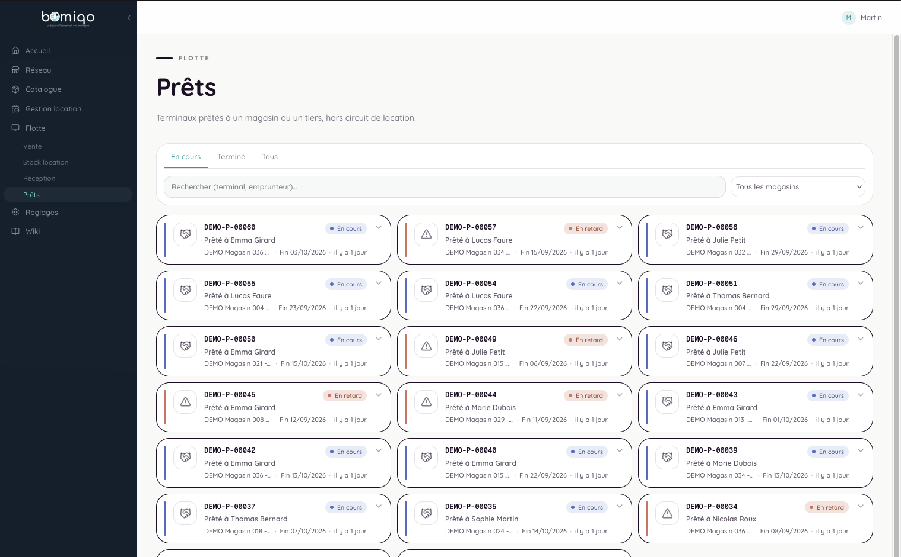
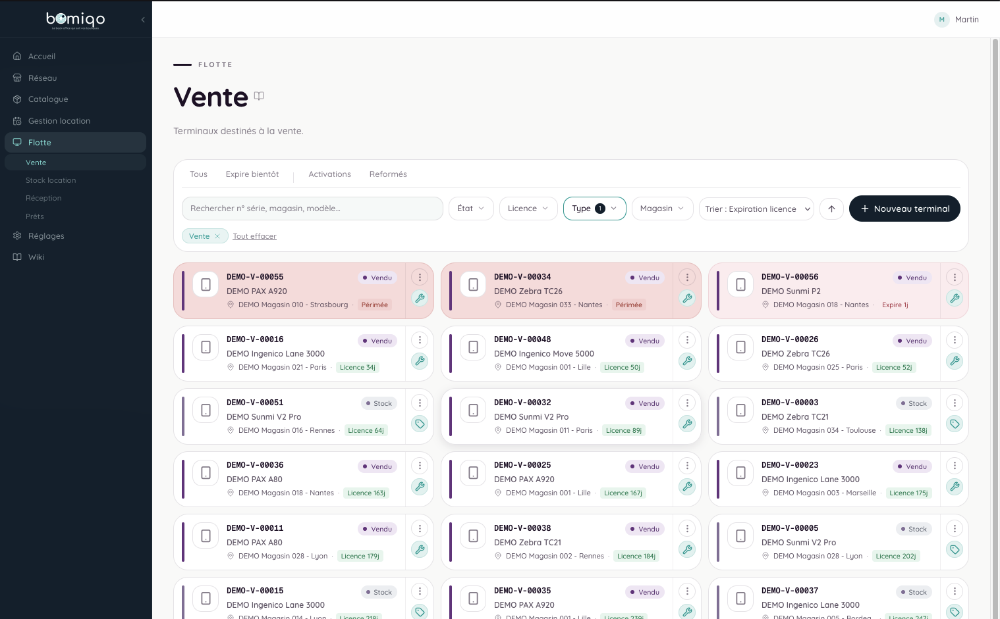

BOMIQO is a web back office built for a multi-brand franchise network (ADBB / BB9 / BVES) managed by AMOPI. The application brings together three pillars: renting out inventory terminals, managing the software licenses deployed at client sites, and syncing their technical infrastructure.

---

### 📦 Terminal rental

AMOPI lends terminals to the network's retail chains so they can run their inventories. BOMIQO tracks the full lifecycle of each loan:
- Date the terminal was shipped.
- Date it was delivered to the client.
- Expected and actual return dates.

---

### 🔑 License management

The software deployed at client sites is protected by a licensing system, with a verification server built directly into the Django backend (no separate service).

---

### 🖥️ Technical infrastructure

BOMIQO automatically syncs technical details about client servers (IP addresses, credentials, etc.) from a MySQL database, driven by Django.

---

### ⚙️ Key features

| Actor | Action | Technology | Details |
|--------|--------|-------------|--------|
| AMOPI | Track a terminal loan | Django + PostgreSQL | Shipping, delivery, and return dates. |
| AMOPI | Manage a software license | Django (built-in verification server) | Validated directly by the backend, with no third-party service. |
| System | Sync client infrastructure | Django + MySQL connection | Automatic retrieval of server IPs, logins, etc. |
| AMOPI | Manage access | DRF + JWT (simplejwt) + `HasPerm` permissions | Fine-grained, scope-based permissions enforced in both the API and the UI. |
| AMOPI | Audit actions | Django audit trail | Covers equipment, sales, rentals, loans, and after-sales service. |

---

### 🏗️ Architecture

The backend follows a hexagonal architecture organized into vertical slices: each Django app (foundation, materiel, auth_api, audit...) cleanly separates models, business logic (services), data access (repositories), and the API (serializers/views), keeping views thin and business logic testable independently of DRF.

The frontend takes a "hook-first" approach built on feature slices: each feature is a self-contained folder with its own types, React Query hooks for API calls, and purely presentational components.

---

### ⚠️ Technical challenges

- Designing a fine-grained, consistent permission system (`HasPerm` + scopes) that applies uniformly to both the API and the UI.
- Building a reliable audit trail covering all sensitive business models (equipment, sales, rentals, loans, after-sales service).
- Making the automatic sync from clients' MySQL databases reliable, even though their availability and schema are outside BOMIQO's direct control.
- Securing the built-in license verification server so it doesn't become a way to bypass licensing.
- Keeping the codebase strictly modular (line limits per file type) to force decomposition rather than piling up complexity.

---

### 📈 Result

A robust back-office platform, tested under real-world conditions through a structured acceptance-testing protocol organized by functional area, covering terminal rental, license management, infrastructure syncing, and after-sales operations.

---

### 🔭 Vision (coming next)

A store-facing portal is planned down the road, so each chain can view its own numbers directly.

---

### 📷 Visuals

*Home: overdue loans, licenses about to expire, available stock, and quick actions (receiving, new terminal, search, inventory).*

*Rental management: timeline of rental requests by store, with statuses (scheduled, shipped, overdue, completed).*

*Rental stock: grid of terminals set aside for rental, with each device's status and license countdown.*

*Receiving: scanning a returned terminal to close out its loan.*

*Loans: terminals lent outside the rental workflow, with due dates and overdue items.*

*Sales: terminals intended for sale, with license expiration tracking.*
