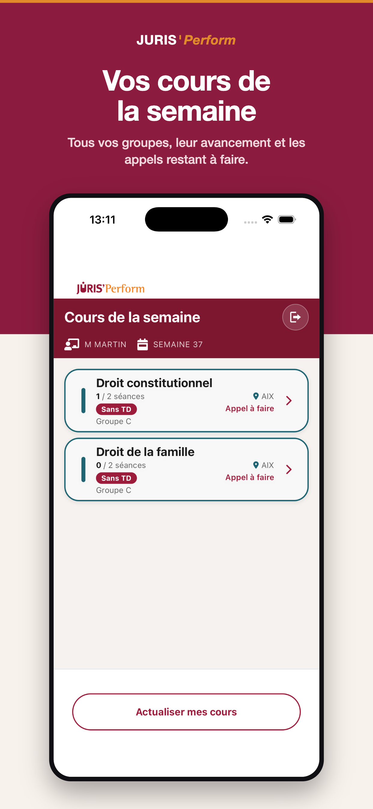
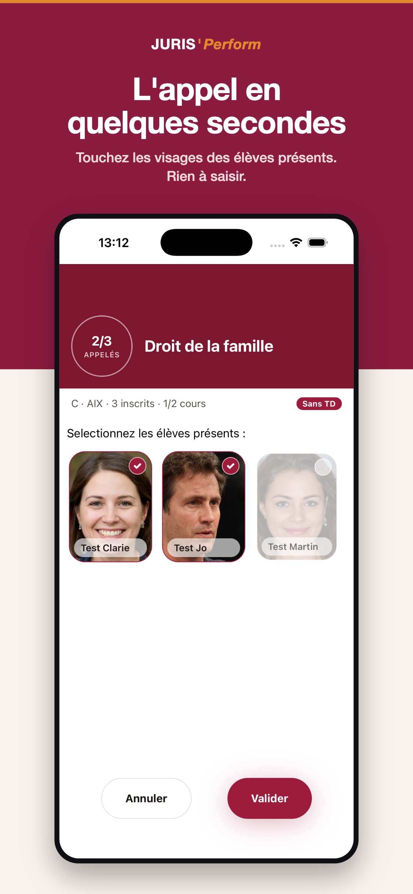
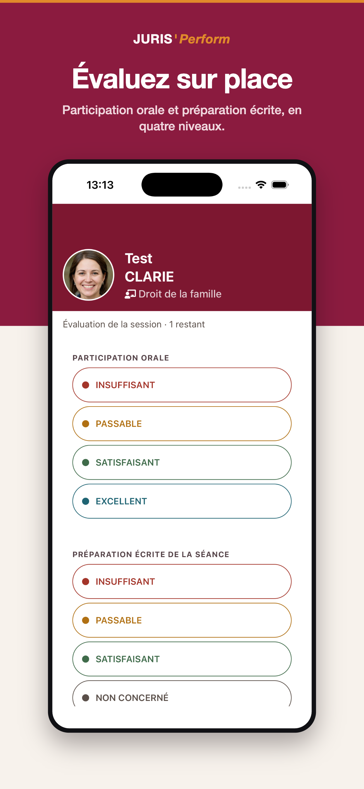

Jurisperform Professeur est l'application mobile des professeurs de Jurisperform. Elle affiche les cours de la semaine, permet de faire l'appel en touchant les photos des étudiants présents, puis guide le professeur pour évaluer chaque étudiant, un par un. Elle s'appuie sur l'API de la plateforme [Jurisperform Licence](/projets/jurisperform-licence).

---

### 🔧 Contexte

Jurisperform propose des cours de soutien en droit aux étudiants de Licence, dans plusieurs villes. Après chaque séance, l'étudiant doit recevoir un compte rendu : présence, participation et commentaire du professeur. Pour que ce compte rendu existe, le professeur doit saisir l'appel et l'évaluation juste après le cours, souvent debout dans la salle, sur son téléphone.

J'ai développé l'application seul. La première version date de septembre 2024. Elle a été mise à jour en septembre 2025 (passage à Expo 53, nouvelle liste des cours), puis entièrement redessinée en août 2026.

---

### 🎯 Le besoin métier

1. **Le professeur se connecte** avec son compte Jurisperform. Seuls les comptes professeurs sont acceptés.
2. **Il voit ses cours de la semaine** : matière, groupe, ville, séances faites sur le total prévu, et ce qu'il reste à faire.
3. **Il fait l'appel** en touchant les photos des étudiants présents.
4. **Il évalue chaque étudiant présent** : participation orale, préparation écrite de la séance et commentaire.
5. **Le compte rendu pédagogique est envoyé** à l'étudiant par la plateforme.

---

### ⚙️ Fonctionnalités clés

- **Cours de la semaine** : les cours sont triés par niveau (L1, L2, L3), puis par groupe. Les groupes qui ont un TD passent en premier. Chaque ville a sa couleur, pour qu'un professeur qui enseigne dans plusieurs villes s'y retrouve d'un coup d'œil. Chaque cours indique « Appel à faire » ou « Séance faite ».
- **Appel par photo** : les étudiants du groupe s'affichent en grille de trois photos. Un toucher marque l'étudiant présent, et un compteur suit le nombre de présents. Un écran récapitulatif permet de vérifier la sélection avant l'envoi.
- **Suivi pédagogique** : après l'appel, l'application enchaîne les étudiants présents un par un, avec la photo, la matière et le nombre d'étudiants restants. Il y a deux critères :
  - la participation orale : insuffisant, passable, satisfaisant ou excellent ;
  - la préparation écrite, avec en plus l'option « non concerné ».
  
  Le commentaire est facultatif. Une fenêtre de confirmation récapitule l'évaluation avant son envoi.
- **Reprise après interruption** : un appel en cours et les évaluations qu'il reste à faire sont gardés sur le téléphone. Si l'application est fermée en plein appel, elle rouvre directement l'écran où le professeur s'était arrêté.
- **Connexion mémorisée** : les identifiants sont stockés dans le trousseau sécurisé du téléphone, et la session est vérifiée auprès de l'API à chaque ouverture.
- **Mise à jour obligatoire** : au lancement, l'application vérifie s'il existe une nouvelle version. Si c'est le cas, elle bloque l'accès et renvoie vers le store.

---

### 🏗️ Architecture

**Application Expo / React Native en TypeScript**

- **Expo Router** : routage par fichiers avec routes typées. Les écrans sont la connexion, les cours, l'appel, le récapitulatif et le suivi pédagogique.
- **MobX** : trois stores (authentification, cours de la semaine, suivi pédagogique en cours), sauvegardés dans AsyncStorage pour survivre à une fermeture de l'application.
- **Couche API** : un service `fetch` centralisé ajoute le jeton JWT à chaque requête. Des hooks (`useAuth`, `useSession`, `useNextPeda`) exposent les appels aux écrans.
- **Design system** : les couleurs, les rayons et l'effet verre sont définis comme des tokens dans `styles/theme.ts`. Deux composants de base, `GlassPanel` (flou réel avec `expo-blur`) et `Pill` (bouton capsule), servent à tous les écrans.

**Échanges avec l'API Django**

- Connexion → liste des cours du professeur → élèves de la séance → envoi des présents. L'API renvoie alors le premier étudiant à évaluer.
- Chaque évaluation envoyée renvoie l'étudiant suivant, jusqu'au message de fin d'appel.
- Les photos arrivent en base64 dans la réponse, ce qui évite une requête par photo.

**Build et distribution**

- **EAS Build** avec trois profils : développement, preview et production. Le numéro de build est incrémenté automatiquement, et la version suit le format `AAAAMMJJHHmm`.
- **Continuous Native Generation** : les dossiers natifs ne sont pas versionnés et sont régénérés au build. Un correctif (`patches/`) sur `expo-modules-jsi` permet de compiler avec Swift 6.2.

---

### ⚠️ Défis techniques

#### 1. Ne jamais perdre un appel en cours

Un professeur peut être interrompu en plein appel : un appel téléphonique, un changement d'application ou une fermeture forcée. Recommencer l'appel voudrait dire perdre les présences déjà saisies.

- La séance et la liste des étudiants cochés sont **enregistrées dans AsyncStorage** à chaque validation d'étape.
- Au retour sur la liste des cours, l'application **redirige automatiquement** vers l'appel en cours, ou vers le suivi pédagogique s'il reste des étudiants à évaluer.
- Ces données locales sont effacées seulement quand l'API confirme la fin de l'appel.

#### 2. Éviter les doubles envois

L'envoi des présences et celui des évaluations créent des données côté serveur : un double envoi produirait des doublons. Sur mobile, un double toucher arrive vite.

- Chaque bouton d'envoi est **verrouillé pendant la requête**, puis déverrouillé à la réponse.
- La navigation est protégée par une **garde synchrone**, pour qu'un double toucher sur un cours n'ouvre pas deux écrans.

#### 3. Garder l'application à jour chez tous les professeurs

L'API évolue, et une vieille version installée sur un téléphone peut ne plus fonctionner avec elle.

- Au démarrage, l'application interroge **expo-updates**. Si une mise à jour existe, un écran bloquant renvoie vers le store.
- Un **test de contrat** en Python (`backend_tests/`) vérifie que l'API renvoie bien les champs attendus par les types TypeScript de l'application : connexion, cours, appel, suivi pédagogique.

#### 4. Redessiner l'application sans casser le métier

En août 2026, l'application a été entièrement redessinée : fond ivoire, panneaux en verre dépoli, bandeau bordeaux et boutons capsules.

- Le travail est parti d'une **spécification** et d'un **plan d'implémentation** écrits avant le code. Chaque écran de la maquette y est associé aux fichiers existants.
- Les tokens et les composants de base ont été créés d'abord, puis les écrans ont été repris un par un.
- La **logique métier est restée identique** : mêmes niveaux d'évaluation, même règle pour « non concerné », mêmes appels à l'API.

---

### 📈 Résultats

- **En production depuis septembre 2024** et publiée sur l'App Store sous le nom *Jurisperform Professeur*.
- **L'appel et l'évaluation se font depuis le téléphone**, juste après la séance. Chaque évaluation alimente le compte rendu pédagogique que la plateforme envoie à l'étudiant.
- **Trois générations de l'application** (2024, 2025, 2026), avec des mises à jour d'Expo jusqu'au SDK 57.

---

### 📷 Visuels

---

### 🧰 Stack technique

- **Front** : React Native 0.86, React 19, Expo SDK 57, Expo Router, TypeScript, MobX, expo-blur, Reanimated
- **Back** : API Django REST de [Jurisperform Licence](/projets/jurisperform-licence), authentification JWT
- **Données** : AsyncStorage (état local et reprise), expo-secure-store (identifiants)
- **Infra** : EAS Build, expo-updates, tests de contrat API en Python (unittest)
